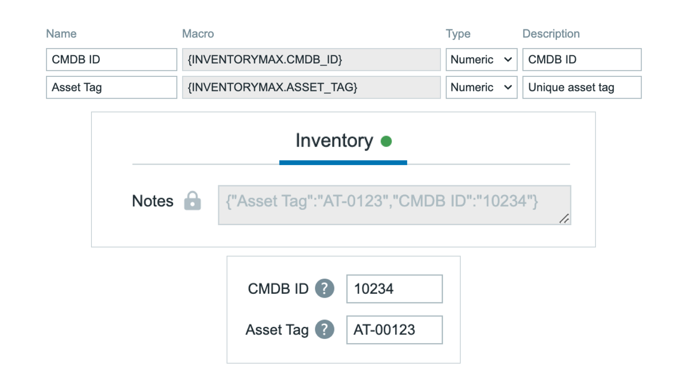

    <h1>
        🔒 PRO Version Available
    </h1>

This is a **PRO-only** product. The full version with all features is available through initMAX PRO subscription.

For more information about initMAX PRO, please visit: [https://www.initmax.com/eshop/](https://www.initmax.com/eshop/)

---

    
    <h3>
        
            Honesty, diligence and MAXimum knowledge of our products is our standard.
        
    </h3>
    <h3>
        &nbsp;&nbsp;&nbsp;
        &nbsp;&nbsp;&nbsp;
        &nbsp;&nbsp;&nbsp;
        &nbsp;&nbsp;&nbsp;
        &nbsp;&nbsp;&nbsp;
        
    </h3>

 

---
---

 
 

    <h1>
        inventoryMAX
    </h1>
    <h4><i>
        Extend Zabbix inventory with custom fields and macros
    </i></h4>
     
    
    
     
    

 
 

## Description
The inventoryMAX module extends Zabbix inventory capabilities by adding custom fields and macros. It introduces a new page under Inventory → inventoryMAX and provides powerful customization options for host inventory management.

Custom field data is stored as JSON in the built-in `{INVENTORY.NOTES}` macro per host, ensuring seamless integration with Zabbix's native inventory system.

## Key Features

### Custom Fields
- **Custom Field Definition**: Create additional inventory fields beyond Zabbix built-in fields
- **Macro Support**: Generate `{INVENTORYMAX.MACROS}` for each custom field
- **Macro Resolution**: Use custom macros in inventoryMAX pages and matrixMAX widget
- **JSON Storage**: Data stored in `{INVENTORY.NOTES}` for each host

### Configuration
- **Administration Panel**: Configure fields under Administration → inventoryMAX fields config
- **Two Configuration Tabs**:
  - **Fields Tab**: Define custom fields with name, macro, type, and description
  - **List columns Tab**: Configure which columns appear in Inventory pages

### Display Control
- **Column Customization**: Select which columns to display in Inventory section
- **Built-in Macros**: Use standard Zabbix macros alongside custom fields
- **Flexible Views**: Customize inventory display per your requirements

### Integration
- **Menu Integration**: Inventory → inventoryMAX
- **matrixMAX Widget**: Custom macros work in matrixMAX widget
- **Macro Resolution**: `{INVENTORYMAX.*}` macros resolve in supported contexts

### Use Cases
- **Extended Metadata**: Store additional host information beyond standard inventory
- **Custom Dashboards**: Use custom inventory macros in matrixMAX widget
- **Asset Management**: Track custom asset properties per host
- **Compliance Data**: Store compliance-related information
- **Business Context**: Add business-specific metadata to hosts

  

    <a href="https://www.initmax.com/wiki/inventorymax/">
         
        <b>Documentation</b> 
        
    </a>

 
 

---
---

 

    <a href="https://www.initmax.com/">
         initMAX.com
    </a>&nbsp;&nbsp;&nbsp;
    <a href="tel:+420800244442">
         +420800244442
    </a>&nbsp;&nbsp;&nbsp;
    <a href="mailto:info@initmax.com">
         info@initmax.com
    </a>
       
    &nbsp;
    &nbsp;
    &nbsp;
    &nbsp;
    &nbsp;
       
    &nbsp;&nbsp;&nbsp;
    
       
    

