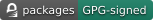
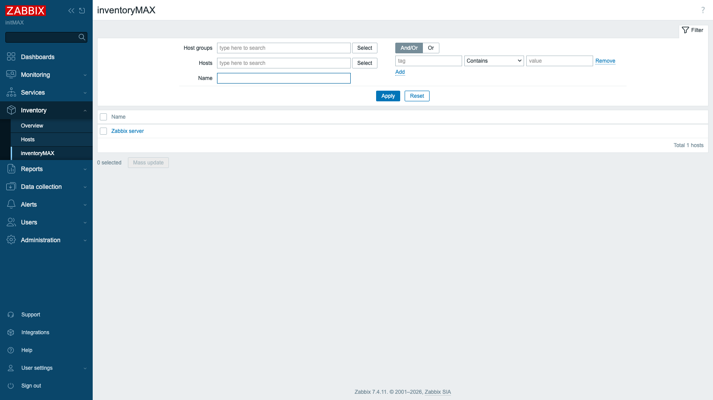
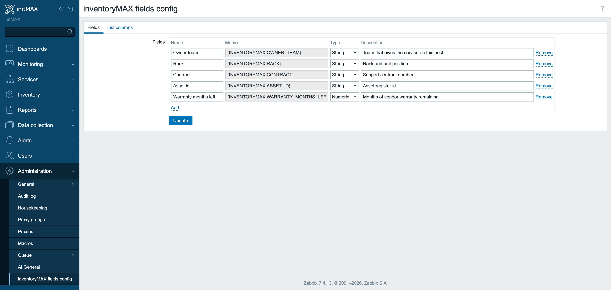
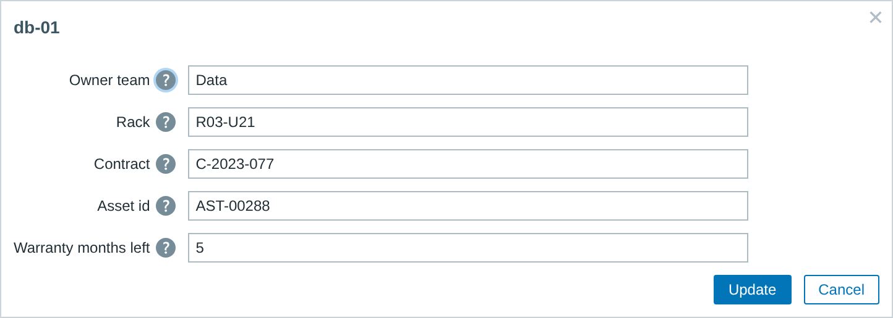
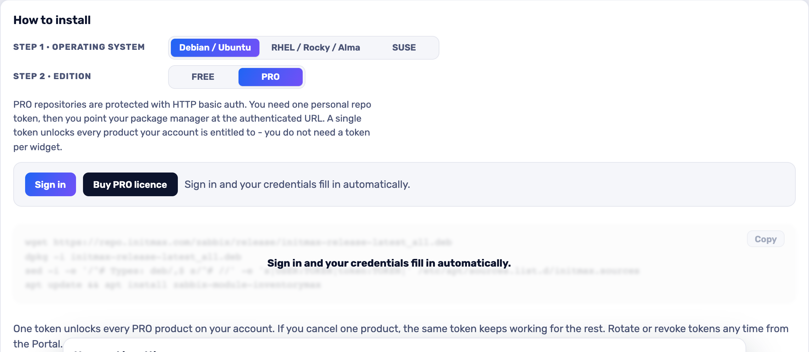

<h1>inventoryMAX</h1>

developed and maintained by

and community

<strong>Zabbix host inventory, with the fields your organisation actually keeps.</strong> 
Zabbix ships a fixed set of inventory fields and no way to add one. inventoryMAX lets you define your own, and gives them a host list, a host form and a mass update of their own.

<a href="#what-you-can-build"><strong>Features</strong></a> &nbsp;·&nbsp;
<a href="#examples"><strong>Examples</strong></a> &nbsp;·&nbsp;
<a href="#install"><strong>Install</strong></a> &nbsp;·&nbsp;
<a href="#free-vs-pro"><strong>FREE vs PRO</strong></a> &nbsp;·&nbsp;
<a href="https://portal.initmax.com"><strong>Portal</strong></a> &nbsp;·&nbsp;
<a href="https://www.initmax.com/wiki/inventorymax/"><strong>Docs</strong></a>

 

---

## Why inventoryMAX

Zabbix's built-in inventory has a fixed list of fields, and the one you need is never on it - the contract number, the owning team, the rack, the asset-register id. inventoryMAX lets you define those fields yourself and then work with them the way you work with the built-in ones: filter the host list by them, edit them per host, and set them across many hosts at once.

## What you can build

<table>
<tr>
<td width="50%" valign="top">

**Asset registers**
Contract numbers, purchase dates and asset ids kept next to the host that carries them.

</td>
<td width="50%" valign="top">

**Ownership records**
Owning team, on-call rota and escalation contact, filterable straight from the host list.

</td>
</tr>
<tr>
<td width="50%" valign="top">

**Location data**
Site, room and rack, entered once and mass-updated when a rack moves.

</td>
<td width="50%" valign="top">

**Dashboard context**
The fields are readable by matrixMAX-Detail, so a dashboard can show what a host IS, not only how it is doing.

</td>
</tr>
</table>

## Examples

<table>
<tr>
<td width="50%" align="center" valign="top"> <small><b>Fields</b> - Select the inventory information that matters and present it consistently across monitored hosts.</small></td>
<td width="50%" align="center" valign="top"> <small><b>Host edit</b> - Edit one host: every custom field with its description on a hint, right from the host list.</small></td>
</tr>
</table>

## Configuration

Two pages, both under **Inventory**. **inventoryMAX fields config** is where the custom fields are defined; **inventoryMAX** is the host list where they are filled in, per host or by mass update.

## Install

**PRO** ships as **GPG-signed `deb` / `rpm` packages** from the initMAX repository - `apt` / `dnf` installs them and keeps them updated.

### Easiest way - the guided installer on the Portal

Open the product page, pick your **OS** and **edition**, and copy the ready-made command. FREE is fully public (no login); PRO fills in your token once you sign in. There's a feedback box right there too.

<a href="https://portal.initmax.com/catalog/zabbix-inventorymax#how-to-install"><strong>→ Open the installer on the Portal</strong></a>

Prefer a plain archive? Every release also ships as a **ZIP**, downloadable from the portal once you sign in - handy for offline or manual installs.

The module is enabled automatically during the package installation - verify it in **Administration → General → Modules**. Done.

## FREE vs PRO

This product is sold as PRO - there is no FREE edition. Everything below is in the one package.

| Feature | PRO |
| ---------------------------------------------------------- | :----: |
| Custom inventory fields | ✅ |
| JSON data storage in "Notes" inventory field | ✅ |
| Seamless integration with matrixMAX | ✅ |
| Filter the host list by custom fields | ✅ |
| Mass update across many hosts | ✅ |
| Custom fields as {INVENTORYMAX.*} macros | ✅ |
| Localised into all 25 Zabbix display languages | ✅ |
| High availability ready | ✅ |
| Licence | [Commercial](./LICENSE-PRO.md) |

## Requirements

|              |                                                              |
| ------------ | ------------------------------------------------------------ |
| **Zabbix**   | 6.0 · 6.2 · 6.4 · 7.0 · 7.2 · 7.4 - one package covers all    |
| **PHP**      | 7.4 or newer                                                 |
| **OS**       | Debian/Ubuntu · RHEL/Rocky/Alma/Oracle/Amazon · SUSE         |
| **Editions** | PRO (token-gated repo) - there is no free edition                  |
| **Languages** | All 25 Zabbix display languages - the module follows each user's own language setting |
| **High availability** | Ready. The custom fields live in the Zabbix database, not on the frontend node; install it on every node of an HA cluster and any node can serve it |

Every capability above works on every supported version - the host list, the filter, the per-host form, the mass update and the field editor are the same pages with the same fields, labels and order on 6.0 as on 7.4. One package covers the range: it carries a second module tree for 6.0/6.2, whose frontend accepts only the older module manifest, and the installer picks the right one.

One cosmetic difference is worth stating plainly: the small hint marker the module puts next to Zabbix's own **Notes** inventory field is a padlock from 7.0 and the round help-hint marker on 6.0 - 6.4, because those releases ship no padlock glyph. Same button, same hint text, same position.

## Support &amp; links

- **[Documentation / Wiki](https://www.initmax.com/wiki/inventorymax/)**
- **[Product page](https://www.initmax.com/product/inventorymax/)**
- **[Portal](https://portal.initmax.com)** - downloads, tokens, support tickets
- **[support@initmax.com](mailto:support@initmax.com)**

---

PRO: <a href="./LICENSE-PRO.md">commercial</a> &nbsp;·&nbsp; © 2021–2026 initMAX s.r.o.

